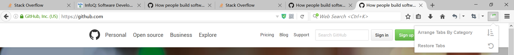
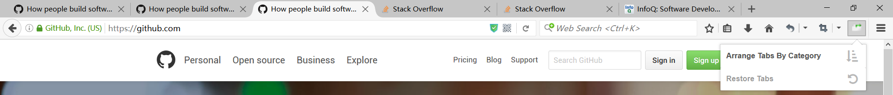
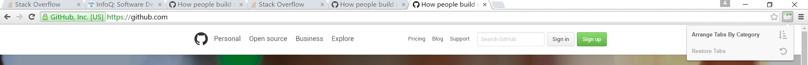
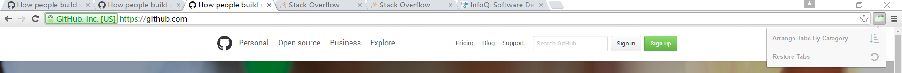
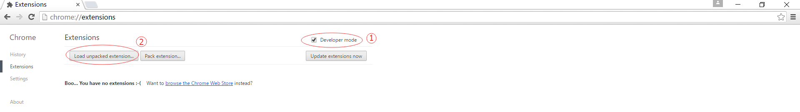

# TabManager
Tab Manager is an extension for Firefox and Chrome that can sort your tabs by category.
## Firefox Demo
Before rearrange tabs:

After rearrange tabs:

## Chrome Demo
Before rearrange tabs:

After rearrange tabs:

## Miscellaneous
You can download the Firefox version from [releases](https://github.com/DeliciousGarfield/tabmanager/tree/master/release). For Chrome, you have to download the source folder to your local drive, and install it from 'Developer Mode'. The Chrome version will be available in a few days.

